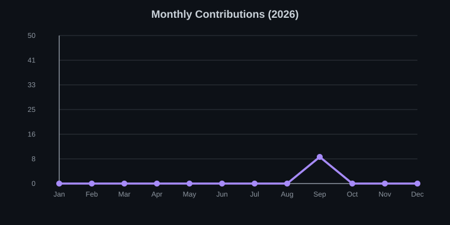

<h1 align="center">Hi, I'm kryvokk 👋</h1>
<h3 align="center">Backend developer in progress • Python & C++</h3>

  

---

### 🚀 About me

- 🎓 First-year student, learning backend development from scratch
- 🐍 Working with **Python** — building toward async/FastAPI
- ⚙️ Working with **C++** — building toward networking/multithreading
- 🐧 Daily-driving Linux
- 🌱 Rebuilt this profile from zero — every pinned repo below is meant to actually run

---

### 🎯 Learning roadmap

**Python track**
- [ ] asyncio — async fundamentals
- [ ] FastAPI — REST APIs, auth, pagination
- [ ] pytest — testing
- [ ] PostgreSQL — schema design, queries
- [ ] Celery/RQ + Redis — background task queues

**C++ track**
- [ ] Modern C++ (17/20) — smart pointers, move semantics
- [ ] CMake — build systems
- [ ] Sockets — TCP client/server basics
- [ ] epoll / multithreading — concurrent servers
- [ ] Qt6 — desktop GUI (secondary track)

**Certifications**
- [ ] freeCodeCamp — Python
- [ ] PCEP (Python Institute)
- [ ] C++ Institute CPA

**Portfolio**
- [ ] Project 1 — Task manager API (FastAPI)
- [ ] Project 2 — Async data aggregator
- [ ] Project 3 — Task queue microservice
- [ ] Project 4 — TCP pub/sub server (C++)
- [ ] Project 5 — In-memory KV store (C++)

> Checked off as I actually finish them — not before.

---

### 🛠 Currently using

  
  
  
  

### 🎯 Learning next

  
  
  
  
  

---

### 📌 Pinned projects

*(pin repos here as you finish them)*

---

### 📈 Monthly coding activity

  

> Auto-updated by `generate_chart.py` via GitHub Actions — pulls real contribution data, no manual edits needed.

---

  

