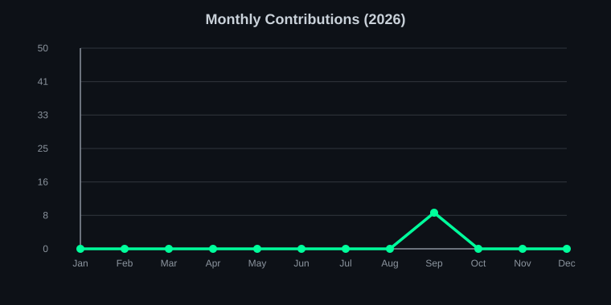

<h1 align="center">kryvokk</h1>

<p align="center">
  <code>backend development — python • c++ • linux</code>
</p>

<p align="center">
  
</p>

<p align="center">
  
</p>

---

### $ whoami

First-year student focused on backend development. Python is my main language, C++ is my systems track — networking and concurrency. Daily driver: Linux. Currently learning async/backend and systems fundamentals in public.

---

### $ focus

```text
python  →  asyncio → fastapi → postgresql → testing → background jobs
c++     →  modern c++ → cmake → sockets → networking → concurrency
```

---

### $ stack

Using now:

<p>
  
</p>

`python` `c` `c++17`

<p>
  
</p>

`linux` `cmake` `git` `bash`

Learning now — not production yet:

<p>
  
</p>

`fastapi` `postgresql` `redis` `docker`

---

### $ activity

<p align="center">
  
</p>

<p align="center">
  <sub>Automatically generated from GitHub contribution data.</sub>
</p>

---

### $ roadmap

```text
python backend:  asyncio → fastapi → postgresql → redis → testing
c++ systems:     modern c++ → cmake → sockets → concurrency
```

Currently pursuing (not yet obtained): `PCEP` `freeCodeCamp Python` `CPA (C++ Institute)`

---

### $ contact

```text
github:  github.com/kryvokk
```
